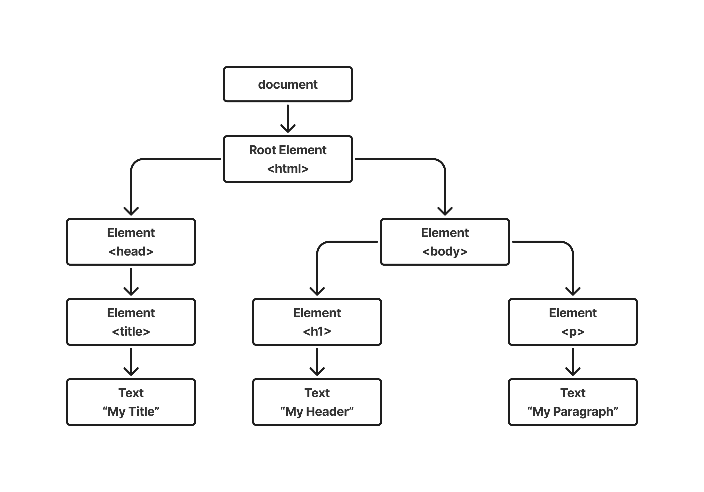

# Revisão M2

Essa é uma revisão da parte de computação da prova do Módulo 2 realizada pelos monitores de computação do primeiro semestre de 2025.

**Monitores**:

- [Anna Giulia Marques Riciopo](https://www.linkedin.com/in/anna-riciopo/) (Slack: Anna Riciopo)
- [Caio de Alcantara Santos](https://www.linkedin.com/in/caio-alcantara-santos/) (Slack: caio.santos)
- [Gabriel Scarpelin Diniz](https://www.linkedin.com/in/gabriel-scarpelin-diniz-425258144/) (Slack: gabriel.diniz)
- [Guilherme Lopes de Carvalho](https://www.linkedin.com/in/guilhermelopescarvalho/) (Slack: Gui Carvalho)

## 1. Introdução aos Sistemas Web

Em computação, os sistemas web são sistemas de informática projetados para utilização através de um navegador, por meio da internet. Esses sistemas funcionam a partir de uma arquitetura chamada **cliente-servidor**, onde o cliente (usuário), através de um navegador (como Chrome, Firefox, Opera, etc.), faz requisições a um servidor onde estão hospedados os sites.

Na arquitetura cliente-servidor, podem ser utilizados diversos **protocolos** para realizar essa comunicação, mas o mais comum é o **HTTPS**, que é o protocolo seguro de transferência de hipertexto, muito utilizado no nosso dia a dia.

### Explicação sobre os Protocolos

Os principais protocolos utilizados em sistemas web são:

- **HTTP (HyperText Transfer Protocol)**: Protocolo básico de comunicação entre clientes e servidores na web. Não oferece segurança nativa.
- **HTTPS (HTTP Secure)**: Versão segura do HTTP, utiliza criptografia através do SSL/TLS para proteger os dados durante a transmissão.
- **FTP (File Transfer Protocol)**: Usado para transferir arquivos entre cliente e servidor.
- **WebSocket**: Protocolo de comunicação bidirecional que permite troca de mensagens em tempo real.

Dentro do protocolo HTTP/HTTPS, existem **métodos de requisição**, também chamados de **métodos HTTP**. Os quatro principais são:

- **GET**: Solicita um recurso específico do servidor (por exemplo: arquivos HTML, JavaScript, imagens).
- **POST**: Envia dados ao servidor, geralmente utilizado em formulários para criar novos recursos.
- **PUT**: Usado para criar ou atualizar um recurso específico no servidor.
- **DELETE**: Utilizado para remover um recurso específico do servidor.

Sempre que fazemos requisições utilizando esses métodos, existem estruturas tanto na requisição quanto na resposta. Essas estruturas são interpretadas principalmente pelo **back-end** e são fundamentais para o funcionamento da aplicação.


Repare que nas respostas recebemos um **código de status HTTP**, que informa se a requisição foi bem-sucedida ou mal-sucedida. Cada código possui um significado específico, conforme a imagem abaixo:


---

### Arquitetura de Sistemas Web

Dentro dos sistemas web convencionais, existem **três partes essenciais da arquitetura**, presentes na maioria dos casos. São elas:

1. **Front-End**
2. **Back-End**
3. **Banco de Dados**

#### Banco de Dados

O banco de dados é o local onde ficam armazenados todos os dados da aplicação. Nele, é possível **criar, deletar, atualizar e consultar dados**.

Existem dois tipos principais de banco de dados:

- **Bancos de Dados Relacionais (SQL)**: Utilizam tabelas com linhas e colunas. Exemplos: **PostgreSQL**, **MySQL**, **SQLite**.
- **Bancos de Dados Não Relacionais (NoSQL)**: Oferecem maior flexibilidade com formatos como documentos (ex: MongoDB), grafos (ex: Neo4j), ou chave-valor (ex: Redis).

#### Back-End

O back-end é onde acontece toda a **lógica da aplicação**, incluindo:

- Processamento de requisições
- Regras de negócio
- Comunicação com o banco de dados
- Retorno de respostas ao cliente

Exemplos de tecnologias de back-end: **Node.js**, **Java (Spring Boot)**, **Python (Django, Flask)**, **PHP (Laravel)**.

#### Front-End

O front-end é a **parte visual** da aplicação, ou seja, a interface com a qual o usuário interage. Inclui:

- Estrutura (HTML)
- Estilo visual (CSS)
- Funcionalidade dinâmica (JavaScript)

Frameworks e bibliotecas comuns: **React**, **Vue.js**, **Angular**.

---

### Ferramentas Comuns no Desenvolvimento Web

Para desenvolver uma aplicação web, algumas ferramentas são amplamente utilizadas:

- **IDE (Editor de Código)**: Ambiente de desenvolvimento para escrever o código da aplicação. Exemplo: **VS Code**.
- **Sistema Gerenciador de Banco de Dados (SGBD)**: Responsável por processar consultas ao banco. Exemplo: **PostgreSQL**, **MySQL**.
- **Plataforma de Hospedagem**: Local onde o banco de dados ou o back-end são hospedados. Exemplo: **Supabase**, **Heroku**, **Vercel**.
- **Ambiente de Execução**: Plataforma para executar código JavaScript fora do navegador. Exemplo: **Node.js**.
- **npm (Node Package Manager)**: Gerenciador de pacotes para o Node.js. Permite instalar bibliotecas e ferramentas.

---

### Controle de Versão e Boas Práticas com Git e GitHub

Um conceito essencial no desenvolvimento web colaborativo é o uso do **Git** e do **GitHub**, onde os desenvolvedores trabalham juntos na mesma aplicação.

Uma das metodologias mais utilizadas para organização do desenvolvimento é o **Git Flow**, um modelo que define um fluxo de trabalho com diferentes tipos de branches.

#### Principais Branches no Git Flow:

- **Main**: Onde ficam as versões finais (builds) do projeto. **Não deve haver commits diretos** nela.
- **Develop**: Branch de desenvolvimento. Todas as novas funcionalidades (features) são integradas nela antes de serem enviadas para a Main.
- **Feature**: Branchs criadas para o desenvolvimento de novas funcionalidades ou telas. Devem ser integradas à Develop quando finalizadas.
- **Hotfix**: Branch para correção de bugs encontrados em produção. Pode ser criada a partir da Main e receber commits diretos pela urgência da correção.


---

### Arquitetura MVC (Model-View-Controller)

Um conceito muito importante no desenvolvimento web é a arquitetura **MVC (Model-View-Controller)**. Ela separa as responsabilidades da aplicação, facilitando a manutenção e a escalabilidade.

#### Componentes do MVC:

- **Model (Modelo)**: Responsável por qualquer comunicação com o banco de dados. Inclui funções para **buscar**, **criar**, **deletar** e **atualizar dados**.
- **View (Visão)**: As telas do site, ou seja, tudo o que o usuário vê e interage.
- **Controller (Controlador)**: Faz a ligação entre as Views e os Models. Contém a lógica que **chama os Models** e **envia os resultados** para as Views.


## 2. Banco de dados

### Básico de SQL

SQL é uma das linguagens mais utilizadas para manipulação de bancos de dados relacionais. Compreender seu funcionamento é essencial para qualquer desenvolvedor.

A primeira ação em um banco de dados vazio é criar as tabelas. A estrutura básica de criação de uma tabela é:

```sql
CREATE TABLE nomeDaTabela (
    id SERIAL PRIMARY KEY, -- Id de identificação da tabela
    coluna1 VARCHAR(100),
    coluna2 VARCHAR(100),
    coluna3 INT
);
```
---

### Estrutura CRUD com SQL

CRUD significa **Create, Read, Update, Delete** – ou seja, as quatro operações básicas de um sistema com banco de dados:

- **CREATE** – Criar dados:

```sql
INSERT INTO tabela (coluna1, coluna2, coluna3)  
VALUES ('dado1', 'dado2', 123);
```

- **READ** – Ler dados:

```sql
SELECT * FROM tabela  
WHERE id = 1;
```

- **UPDATE** – Atualizar dados:

```sql
UPDATE tabela  
SET coluna1 = 'Novo valor', coluna2 = 'Outro valor'  
WHERE id = 1;
```

- **DELETE** – Remover dados:

```sql
DELETE FROM tabela  
WHERE id = 1;
```

Essas operações são a base da manipulação de dados em qualquer aplicação web.

Para aprofundamento, recomendamos o canal **Programação Dinâmica**, especialmente este vídeo introdutório sobre [queries SQL](https://www.youtube.com/watch?v=DUYnl5CS0Po).

### SQL Joins

Um JOIN é um meio de combinar colunas de uma (auto-junção) ou mais tabelas, usando valores comuns a cada uma delas (geralmente chave estrangeira).

Existem quatro tipos principais de JOIN:

- INNER JOIN: Traz apenas os registros que existem nas duas tabelas.
- LEFT JOIN: Traz todos os registros da tabela da esquerda, mesmo que não haja correspondência na da direita.
- RIGHT JOIN: Traz todos os registros da tabela da direita, mesmo que não haja correspondência na da esquerda.
- FULL JOIN: Traz todos os registros das duas tabelas, combinando os que têm correspondência, e mostrando nulos onde não houver.


Alguns exemplos da aplicação de JOINS em SQL:

**INNER JOIN**

```sql
SELECT
    clientes.nome,           -- Seleciona o nome do cliente
    pedidos.produto          -- Seleciona o produto que ele pediu
FROM
    clientes
INNER JOIN pedidos           -- Faz o INNER JOIN entre as tabelas clientes e pedidos
    ON clientes.id_cliente = pedidos.id_cliente;  -- Condição de junção: id_cliente deve ser igual nas duas tabelas
```

Esse comando retorna somente os clientes que têm pedidos cadastrados. Se o cliente não tiver pedido, ele não aparece no resultado.

**LEFT JOIN**

```sql
SELECT
    clientes.nome,           -- Nome do cliente
    pedidos.produto          -- Produto pedido (pode ser NULL se o cliente não tiver pedido)
FROM
    clientes
LEFT JOIN pedidos            -- LEFT JOIN: Traz todos os clientes, mesmo que não tenham pedidos
    ON clientes.id_cliente = pedidos.id_cliente;  -- Relaciona clientes aos seus pedidos
```

Retorna todos os clientes, e os campos de pedidos aparecem como NULL caso o cliente não tenha feito nenhum pedido.

**RIGHT JOIN**

```sql
SELECT
    clientes.nome,           -- Nome do cliente (pode ser NULL se o pedido estiver sem cliente)
    pedidos.produto          -- Produto do pedido
FROM
    clientes
RIGHT JOIN pedidos           -- RIGHT JOIN: Traz todos os pedidos, mesmo que o cliente esteja ausente
    ON clientes.id_cliente = pedidos.id_cliente;  -- Condição de junção
```

Retorna todos os pedidos, mesmo se houver um pedido associado a um cliente que não existe na tabela de clientes (caso haja falhas de integridade referencial).

**FULL JOIN**

```sql
SELECT
    clientes.nome,           -- Nome do cliente (pode ser NULL)
    pedidos.produto          -- Produto do pedido (pode ser NULL)
FROM
    clientes
FULL JOIN pedidos            -- FULL JOIN: Une todos os registros de ambas as tabelas
    ON clientes.id_cliente = pedidos.id_cliente;  -- Condição de junção
```

Retorna todos os clientes e todos os pedidos, com ou sem correspondência entre eles. Se o cliente não tem pedido, ou o pedido não tem cliente, os campos da tabela faltante aparecem como NULL.

## 3. Back-End

Todos os back-ends funcionam de forma **API RESTful**, que é uma interface para acessar e manipular recursos através da web, usando os princípios do HTTP e da arquitetura REST. Ela fornece um conjunto de regras para criar APIs simples, organizadas e fáceis de entender.

Por meio das APIs, é possível:

- Realizar operações CRUD (**Create**, **Read**, **Update**, **Delete**) nos recursos. Cada operação é mapeada para um método HTTP específico.
- Navegar para outros recursos relacionados (como outras páginas de um site).

Ou seja, API RESTful é a forma como a aplicação se comunica com o mundo externo.

Como dito anteriormente, a arquitetura **MVC** é uma convenção muito utilizada em aplicações web para organizar o código. Ela é bastante popular por facilitar a manutenção, especialmente em metodologias API RESTful, já que, juntos, ajudam a manter o projeto limpo, escalável e fácil de manter.

### Models

O **Model** é o responsável pelos **dados e pela lógica de negócio**. Ou seja, dentro dele, é necessário implementar um CRUD para manipular o banco de dados.

Por convenção, é importante que exista **um model para cada tabela** do banco de dados, e **toda e qualquer manipulação de dados seja feita pelos models**, e **não diretamente pelos controllers ou services**.

Exemplo de código de um Model:

```javascript
class User {
  static async getAll() {
    const result = await db.query('SELECT * FROM users');
    return result.rows;
  }
}
```

Repare que o Model utiliza SQL em seu corpo para fazer as **queries**!

### Controllers

Os **Controllers** atuam como intermediários entre as rotas e os models. Eles recebem as **requisições HTTP**, processam os dados (geralmente chamando serviços ou models) e retornam uma resposta ao cliente.

O controller **não deve fazer nenhuma requisição direta ao banco de dados**, já que isso é papel do Model.

Exemplo de código de um Controller:

```javascript
const userModel = require('../models/userModel');

const getAllUsers = async (req, res) => {
  try {
    const users = await userModel.getAll();
    res.status(200).json(users);
  } catch (error) {
    res.status(500).json({ error: error.message });
  }
};
```

Repare nos **status** enviados: todos são **HTTP Status Codes**, explicados no primeiro capítulo!

### Views

As **Views** representam a **interface visual** da aplicação, ou seja, **o que o usuário vê e interage**.

Exemplos de Views:

- Arquivos HTML
- Templates EJS
- Páginas renderizadas com frameworks frontend

No caso de uma API pura, pode-se dizer que **o cliente (front-end) é a view**, e os dados trafegam em formato JSON, por exemplo.

### Routes

Para realizar a comunicação entre a **view** e o **controller**, são utilizadas as **rotas**, que são caminhos que o usuário pode acessar para disparar funções específicas.

As rotas também são responsáveis por determinar **qual tela aparecerá em cada caminho**, renderizando a view de acordo com a rota.

É importante também mencionar que o termo **endpoint** surge das rotas. O **endpoint** é onde **acaba o caminho do MVC**, ou seja:

1. Existe um protocolo HTTP (GET, POST, etc.);
2. Existe uma função no controller para aquela rota;
3. Existe uma função no model que o controller irá chamar.

Exemplo de código de uma rota:

```javascript
router.get('/', userController.getAllUsers); // Eu sou o endpoint XD
```

Repare que ela faz uma **requisição HTTP**!

Uma forma de abstrair o MVC é pensar que você está em um restaurante:

- A **View** é o **restaurante** (o que o cliente vê);
- As **Rotas** são o **cardápio** (as opções que você pode pedir);
- O **Controller** é o **garçom** (que leva o pedido para a cozinha);
- O **Model** é o **chef de cozinha** (quem prepara a informação);
- E o **banco de dados** são os **ingredientes**.

## 4. Front-end 

### O que é Front-end?

&emsp;Front‑end é a parte de um aplicativo ou site com a qual o usuário interage diretamente. Engloba tudo que é exibido no navegador — layout, estilos, comportamento e conteúdo dinâmico.

### O que inclui na área de Front‑end  

1. **HTML (HyperText Markup Language):**  
   - Estrutura semântica dos documentos.  
   - Marcação de títulos, parágrafos, listas, formulários etc.

2. **CSS (Cascading Style Sheets):**  
   - Estilização: cores, fontes, espaçamentos e posicionamentos.  
   - Layouts responsivos (media queries, Flexbox, Grid).

3. **JavaScript:**  
   - Comportamento dinâmico e interatividade.  
   - Manipulação do DOM, requisições HTTP, animações e lógica de negócios no cliente.

## 5. DOM (Document Object Model)  

### O que é DOM?

O DOM funciona como uma API que traduz um documento HTML em uma representação hierárquica na memória. Ao carregar uma página, o navegador constrói esse modelo interno, permitindo que o JavaScript navegue pela sua estrutura e faça alterações dinamicamente.

**Organização em árvore:**

- O nó principal, chamado `document`, fica no topo da hierarquia.
- Cada elemento HTML (por exemplo `<html>`, `<body>`, `<h1>`, `<p>`) é transformado em um *Element Node*.
- O texto contido nesses elementos vira um *Text Node*.
- Os valores associados às tags (como `class`, `id` ou outros atributos) passam a ser *Attribute Nodes*.




### Selecionando elementos

- **Elemento único:**
  - `document.getElementById('elementId')`: pelo ID do elemento 
  - `document.querySelector('cssSelector')`: pelo seletor CSS do elemento

- **Múltiplos elementos:**
  - `document.getElementsByTagName('tagName')`: retorna uma `HTMLCollection` ao vivo de todos os elementos com a tag 
  - `document.getElementsByClassName('className')`: seleciona todos os elementos com a classe especificada 
  - `document.querySelectorAll('cssSelector')`: retorna uma `NodeList` estática com todos os elementos que correspondem ao seletor CSS


### Manipulando conteúdo

- **Texto:**
  - `textContent`: Seguro contra XSS, trata tudo como texto literal
  - `innerHTML`: Poderoso mas perigoso se usado com entrada não confiável
  - `outerHTML`: Inclui o próprio elemento na string de HTML

- **Valor de inputs:**
  - `value`: Usado para acessar ou alterar o valor de `<input>`, `<textarea>` ou `<select>`


### Manipulando atributos

- `element.getAttribute('atributo')`: Recupera o valor de um atributo específico.
- `element.setAttribute('atributo', 'valor')`: Define ou atualiza o valor de um atributo.
- `element.removeAttribute('atributo')`: Remove o atributo do elemento.
- `element.hasAttribute('atributo')`: Verifica se o atributo existe.


### Manipulando classes e estilos

- **Classes:**
  - `element.classList.add('classe')`
  - `element.classList.remove('classe')`
  - `element.classList.toggle('classe')`
  - `element.classList.contains('classe')`

- **Estilos:**
  - `element.style.property`: Define ou obtém estilos inline (ex: `element.style.color = 'red'`)


### Criando e inserindo elementos

- `document.createElement('tag')`: Cria um novo elemento HTML.
- `document.createTextNode('texto')`: Cria um nó de texto.
- `parent.appendChild(child)`: Adiciona um nó filho ao final de um elemento pai.
- `parent.insertBefore(novoElemento, elementoReferencia)`: Insere antes de outro elemento.
- `element.append(...)`: Insere nós ou strings no final.
- `element.prepend(...)`: Insere no início.


### Removendo elementos

- `element.remove()`: Remove o próprio elemento.
- `parent.removeChild(child)`: Remove um filho específico.


### Navegando pela árvore DOM

- `element.parentNode`: Nó pai.
- `element.children`: Coleção de elementos filhos.
- `element.firstChild` / `element.lastChild`: Primeiro e último nó filho.
- `element.firstElementChild` / `element.lastElementChild`: Primeiro e último *elemento* filho.
- `element.nextSibling` / `element.previousSibling`: Nó irmão seguinte ou anterior.
- `element.nextElementSibling` / `element.previousElementSibling`: *Elemento* irmão seguinte ou anterior.


### Lidando com eventos

- `element.addEventListener('evento', callback)`: Escuta um evento.
- `element.removeEventListener('evento', callback)`: Remove o ouvinte.

**Eventos comuns:**

- `click`: Clique do mouse
- `input`: Alterações em campos
- `submit`: Envio de formulários
- `mouseover` / `mouseout`: Interação com o mouse
- `keydown` / `keyup`: Teclado pressionado/solto

## 6. Redes de Computadores, HTTP e Arquitetura Cliente‑Servidor

### Redes de Computadores

- Estrutura composta por diversos dispositivos conectados por protocolos (ex: TCP/IP).
- **Modelo OSI** com 7 camadas (Física, Enlace, Rede, Transporte, Sessão, Apresentação, Aplicação) para organizar funções da rede.
- **Modelo TCP/IP** possui 4 camadas: Aplicação, Transporte, Internet, Acesso à Rede.
- Cada dispositivo tem um endereço IP; comunicação ocorre via sockets TCP/UDP.
- Redes podem ser classificadas como LAN, MAN, WAN, etc. (PAN, LAN, MAN, WAN).


### Arquitetura Cliente‑Servidor

- Estrutura distribuída:
  - **Cliente** inicia requisições (ex: navegador, app móvel).
  - **Servidor** atende requisições e devolve respostas.
- **Fluxo básico**:
  1. Cliente envia requisição via rede.
  2. Servidor processa e busca dados (banco, arquivos).
  3. Servidor envia resposta ao cliente.
  4. Cliente exibe ou processa o resultado.
- **Vantagens**:
  - Centralização, escalabilidade, segurança, manutenção facilitada.
- **Desafios**:
  - Ponto único de falha, dependência de servidor, complexidade de configuração.
- **Camadas**:
  - **2 camadas**: cliente + servidor de dados.
  - **3 camadas**: cliente, camada de negócio (aplicação), camada de dados.


### Requisições e Respostas HTTP

- **HTTP** é protocolo da camada de aplicação sobre TCP/IP; HTTPS usa TLS/SSL.
- Funciona no paradigma requisição–resposta (stateless): cada requisição é independente.
- **Componentes de uma requisição**:
  - **Request line**: método + URI + versão (ex: `GET /index.html HTTP/1.1`)
  - **Headers**: metadados (Host, Content-Type, Authorization, Cookies etc.).
  - **Corpo (body)**: opção para métodos como POST/PUT.
- **Principais métodos HTTP**:
  - `GET`, `POST`, `PUT`, `DELETE`, `HEAD`, `OPTIONS`, `TRACE`, `CONNECT`.
- **Códigos de resposta**:
  - 1xx (informação), 2xx (sucesso, ex: 200 OK), 3xx (redirecionamento), 4xx (erro do cliente, ex: 404), 5xx (erro do servidor, ex: 500).
- **HTTPS**: HTTP sobre TLS/SSL, adicionando criptografia e autenticação via certificados digitais.


### Componentes HTTP (headers mais usados)

| Header               | Função |
|----------------------|--------|
| `Host`               | Define o domínio do servidor |
| `Content-Type`, `Content-Length` | Tipo e tamanho do corpo da mensagem |
| `Accept`             | Tipos de resposta aceitos pelo cliente |
| `Cookie`, `Set-Cookie` | Envio e definição de cookies |
| `Authorization`      | Autenticação do cliente |
| `Cache-Control`      | Controle de cache |
| `User-Agent`         | Identificação do cliente |

### Resumo geral

- **Redes de computadores**: comunicação organizada por camadas (OSI, TCP/IP), protocolos (IP, TCP/UDP).
- **Cliente‑servidor**: modelo onde clientes solicitam recursos e servidores respondem, podendo ter arquiteturas de 2 ou 3 camadas.
- **HTTP/HTTPS**: protocolo aplicado para web, funcional e seguro, com requisições independentes, métodos, headers e códigos de status.


