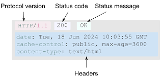

# Revisão M2

Essa é uma revisão da parte de computação da prova do Módulo 2 realizada pelos monitores de computação do primeiro semestre de 2025.

**Monitores**:

- [Anna Giulia Marques Riciopo](https://www.linkedin.com/in/anna-riciopo/) (Slack: Anna Riciopo)
- [Caio de Alcantara Santos](https://www.linkedin.com/in/caio-alcantara-santos/) (Slack: caio.santos)
- [Gabriel Scarpelin Diniz](https://www.linkedin.com/in/gabriel-scarpelin-diniz-425258144/) (Slack: gabriel.diniz)
- [Guilherme Lopes de Carvalho](https://www.linkedin.com/in/guilhermelopescarvalho/) (Slack: Gui Carvalho)

## 1. Introdução aos Sistemas Web

Em computação, os sistemas web são sistemas de informática projetados para utilização através de um navegador, por meio da internet. Esses sistemas funcionam a partir de uma arquitetura chamada **cliente-servidor**, onde o cliente (usuário), através de um navegador (como Chrome, Firefox, Opera, etc.), faz requisições a um servidor onde estão hospedados os sites.

Na arquitetura cliente-servidor, podem ser utilizados diversos **protocolos** para realizar essa comunicação, mas o mais comum é o **HTTPS**, que é o protocolo seguro de transferência de hipertexto, muito utilizado no nosso dia a dia.

### Explicação sobre os Protocolos

Os principais protocolos utilizados em sistemas web são:

- **HTTP (HyperText Transfer Protocol)**: Protocolo básico de comunicação entre clientes e servidores na web. Não oferece segurança nativa.
- **HTTPS (HTTP Secure)**: Versão segura do HTTP, utiliza criptografia através do SSL/TLS para proteger os dados durante a transmissão.
- **FTP (File Transfer Protocol)**: Usado para transferir arquivos entre cliente e servidor.
- **WebSocket**: Protocolo de comunicação bidirecional que permite troca de mensagens em tempo real.

Dentro do protocolo HTTP/HTTPS, existem **métodos de requisição**, também chamados de **métodos HTTP**. Os quatro principais são:

- **GET**: Solicita um recurso específico do servidor (por exemplo: arquivos HTML, JavaScript, imagens).
- **POST**: Envia dados ao servidor, geralmente utilizado em formulários para criar novos recursos.
- **PUT**: Usado para criar ou atualizar um recurso específico no servidor.
- **DELETE**: Utilizado para remover um recurso específico do servidor.

Sempre que fazemos requisições utilizando esses métodos, existem estruturas tanto na requisição quanto na resposta. Essas estruturas são interpretadas principalmente pelo **back-end** e são fundamentais para o funcionamento da aplicação.




Repare que nas respostas recebemos um **código de status HTTP**, que informa se a requisição foi bem-sucedida ou mal-sucedida. Cada código possui um significado específico, conforme a imagem abaixo:


---

### Arquitetura de Sistemas Web

Dentro dos sistemas web convencionais, existem **três partes essenciais da arquitetura**, presentes na maioria dos casos. São elas:

1. **Front-End**
2. **Back-End**
3. **Banco de Dados**

#### Banco de Dados

O banco de dados é o local onde ficam armazenados todos os dados da aplicação. Nele, é possível **criar, deletar, atualizar e consultar dados**.

Existem dois tipos principais de banco de dados:

- **Bancos de Dados Relacionais (SQL)**: Utilizam tabelas com linhas e colunas. Exemplos: **PostgreSQL**, **MySQL**, **SQLite**.
- **Bancos de Dados Não Relacionais (NoSQL)**: Oferecem maior flexibilidade com formatos como documentos (ex: MongoDB), grafos (ex: Neo4j), ou chave-valor (ex: Redis).

#### Back-End

O back-end é onde acontece toda a **lógica da aplicação**, incluindo:

- Processamento de requisições
- Regras de negócio
- Comunicação com o banco de dados
- Retorno de respostas ao cliente

Exemplos de tecnologias de back-end: **Node.js**, **Java (Spring Boot)**, **Python (Django, Flask)**, **PHP (Laravel)**.

#### Front-End

O front-end é a **parte visual** da aplicação, ou seja, a interface com a qual o usuário interage. Inclui:

- Estrutura (HTML)
- Estilo visual (CSS)
- Funcionalidade dinâmica (JavaScript)

Frameworks e bibliotecas comuns: **React**, **Vue.js**, **Angular**.

---

### Ferramentas Comuns no Desenvolvimento Web

Para desenvolver uma aplicação web, algumas ferramentas são amplamente utilizadas:

- **IDE (Editor de Código)**: Ambiente de desenvolvimento para escrever o código da aplicação. Exemplo: **VS Code**.
- **Sistema Gerenciador de Banco de Dados (SGBD)**: Responsável por processar consultas ao banco. Exemplo: **PostgreSQL**, **MySQL**.
- **Plataforma de Hospedagem**: Local onde o banco de dados ou o back-end são hospedados. Exemplo: **Supabase**, **Heroku**, **Vercel**.
- **Ambiente de Execução**: Plataforma para executar código JavaScript fora do navegador. Exemplo: **Node.js**.
- **npm (Node Package Manager)**: Gerenciador de pacotes para o Node.js. Permite instalar bibliotecas e ferramentas.

---

### Controle de Versão e Boas Práticas com Git e GitHub

Um conceito essencial no desenvolvimento web colaborativo é o uso do **Git** e do **GitHub**, onde os desenvolvedores trabalham juntos na mesma aplicação.

Uma das metodologias mais utilizadas para organização do desenvolvimento é o **Git Flow**, um modelo que define um fluxo de trabalho com diferentes tipos de branches.

#### Principais Branches no Git Flow:

- **Main**: Onde ficam as versões finais (builds) do projeto. **Não deve haver commits diretos** nela.
- **Develop**: Branch de desenvolvimento. Todas as novas funcionalidades (features) são integradas nela antes de serem enviadas para a Main.
- **Feature**: Branchs criadas para o desenvolvimento de novas funcionalidades ou telas. Devem ser integradas à Develop quando finalizadas.
- **Hotfix**: Branch para correção de bugs encontrados em produção. Pode ser criada a partir da Main e receber commits diretos pela urgência da correção.


---

### Arquitetura MVC (Model-View-Controller)

Um conceito muito importante no desenvolvimento web é a arquitetura **MVC (Model-View-Controller)**. Ela separa as responsabilidades da aplicação, facilitando a manutenção e a escalabilidade.

#### Componentes do MVC:

- **Model (Modelo)**: Responsável por qualquer comunicação com o banco de dados. Inclui funções para **buscar**, **criar**, **deletar** e **atualizar dados**.
- **View (Visão)**: As telas do site, ou seja, tudo o que o usuário vê e interage.
- **Controller (Controlador)**: Faz a ligação entre as Views e os Models. Contém a lógica que **chama os Models** e **envia os resultados** para as Views.


## 2. Banco de dados

### Básico de SQL

SQL é uma das linguagens mais utilizadas para manipulação de bancos de dados relacionais. Compreender seu funcionamento é essencial para qualquer desenvolvedor.

A primeira ação em um banco de dados vazio é criar as tabelas. A estrutura básica de criação de uma tabela é:

```sql
CREATE TABLE nomeDaTabela (
    id SERIAL PRIMARY KEY, -- Id de identificação da tabela
    coluna1 VARCHAR(100),
    coluna2 VARCHAR(100),
    coluna3 INT
);
```
---

### Estrutura CRUD com SQL

CRUD significa **Create, Read, Update, Delete** – ou seja, as quatro operações básicas de um sistema com banco de dados:

- **CREATE** – Criar dados:

```sql
INSERT INTO tabela (coluna1, coluna2, coluna3)  
VALUES ('dado1', 'dado2', 123);
```

- **READ** – Ler dados:

```sql
SELECT * FROM tabela  
WHERE id = 1;
```

- **UPDATE** – Atualizar dados:

```sql
UPDATE tabela  
SET coluna1 = 'Novo valor', coluna2 = 'Outro valor'  
WHERE id = 1;
```

- **DELETE** – Remover dados:

```sql
DELETE FROM tabela  
WHERE id = 1;
```

Essas operações são a base da manipulação de dados em qualquer aplicação web.

Para aprofundamento, recomendamos o canal **Programação Dinâmica**, especialmente este vídeo introdutório sobre [queries SQL](https://www.youtube.com/watch?v=DUYnl5CS0Po).

### SQL Joins

Um JOIN é um meio de combinar colunas de uma (auto-junção) ou mais tabelas, usando valores comuns a cada uma delas (geralmente chave estrangeira).

Existem quatro tipos principais de JOIN:

- INNER JOIN: Explicar
- LEFT JOIN: Explicar
- RIGHT JOIN: Explicar
- FULL JOIN: Explicar


Alguns exemplos da aplicação de JOINS em SQL:

**INNER JOIN**

```sql
SELECT
    clientes.nome,           -- Seleciona o nome do cliente
    pedidos.produto          -- Seleciona o produto que ele pediu
FROM
    clientes
INNER JOIN pedidos           -- Faz o INNER JOIN entre as tabelas clientes e pedidos
    ON clientes.id_cliente = pedidos.id_cliente;  -- Condição de junção: id_cliente deve ser igual nas duas tabelas
```

Esse comando retorna somente os clientes que têm pedidos cadastrados. Se o cliente não tiver pedido, ele não aparece no resultado.

**LEFT JOIN**

```sql
SELECT
    clientes.nome,           -- Nome do cliente
    pedidos.produto          -- Produto pedido (pode ser NULL se o cliente não tiver pedido)
FROM
    clientes
LEFT JOIN pedidos            -- LEFT JOIN: Traz todos os clientes, mesmo que não tenham pedidos
    ON clientes.id_cliente = pedidos.id_cliente;  -- Relaciona clientes aos seus pedidos
```

Retorna todos os clientes, e os campos de pedidos aparecem como NULL caso o cliente não tenha feito nenhum pedido.

**RIGHT JOIN**

```sql
SELECT
    clientes.nome,           -- Nome do cliente (pode ser NULL se o pedido estiver sem cliente)
    pedidos.produto          -- Produto do pedido
FROM
    clientes
RIGHT JOIN pedidos           -- RIGHT JOIN: Traz todos os pedidos, mesmo que o cliente esteja ausente
    ON clientes.id_cliente = pedidos.id_cliente;  -- Condição de junção
```

Retorna todos os pedidos, mesmo se houver um pedido associado a um cliente que não existe na tabela de clientes (caso haja falhas de integridade referencial).

**FULL JOIN**

```sql
SELECT
    clientes.nome,           -- Nome do cliente (pode ser NULL)
    pedidos.produto          -- Produto do pedido (pode ser NULL)
FROM
    clientes
FULL JOIN pedidos            -- FULL JOIN: Une todos os registros de ambas as tabelas
    ON clientes.id_cliente = pedidos.id_cliente;  -- Condição de junção
```

Retorna todos os clientes e todos os pedidos, com ou sem correspondência entre eles. Se o cliente não tem pedido, ou o pedido não tem cliente, os campos da tabela faltante aparecem como NULL.

## 3. Back-End

Todos os Back-End funcionam de foram API RESTful, que é uma interface para acessar e manipular recursos através da web usando os princípios do HTTP e da arquitetura REST. Ela fornece um conjunto de regras para criar APIs que sejam simples, organizadas e fáceis de entender.

Através de API's é possível:

- Realização de operações CRUD (Create, Read, Update, Delete) nos recursos. Cada operação é mapeada para um método HTTP específico.
- navegar para outros recursos relacionados (Como outras páginas de um site).

Ou seja, API RESTful é a forma como a aplicação se comunica com o mundo externo.

Como dito anteriormente, a arquitetura MVC é uma convenção utilizada em aplicações WEB, organizando os códigos. Ela é muito utilizada porque é muito util, em questões de manutenção, em metodologias API RESTful, já que Juntos, eles ajudam a manter o projeto limpo, escalável e fácil de manter.

### Models

O model é o responsável por Dados e lógica de negócio. Ou seja, dentro dele é necessário um CRUD para fazer toda a manipulação do banco de dados. Por convenção, é importante que exista um model para cada tabela do banco de dados e TODA e qualquer manipulação seja feita por eles, e não por controllers ou services.

Exemplo do código de um model:

```javascript
